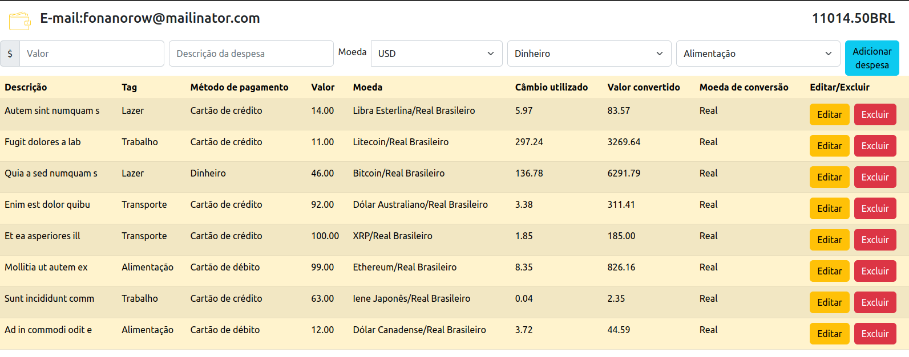

<h1 align="center">Trybe Wallet</h1>


# Sobre

Acesse a aplicação : [walletgfr.netlify.app](walletgfr.netlify.app)

Neste projeto, o usuário pode adicionar despesas em uma planilha de gastos, podendo editar, excluir e converter os valores da despesa em diversas moedas e criptomoedas. Além disso ele deve efetuar um login com um email válido e senha.


## Tecnologias usadas

Front-end:
> Desenvolvido usando: 
> * React com componentes de classe;
> * Redux para gerenciamento de estado;
> * Estilização utilizando somente Bootstrap;
> * HTML5, ES6, 
> * Consumo de API de conversão de moedas.


## Instalando Dependências

```bash
git clone git@github.com:GabrielFerrariR/Wallet.git
cd Wallet
npm install
``` 
## Executando aplicação

Para rodar o front-end:

  ```
npm start
  ```

